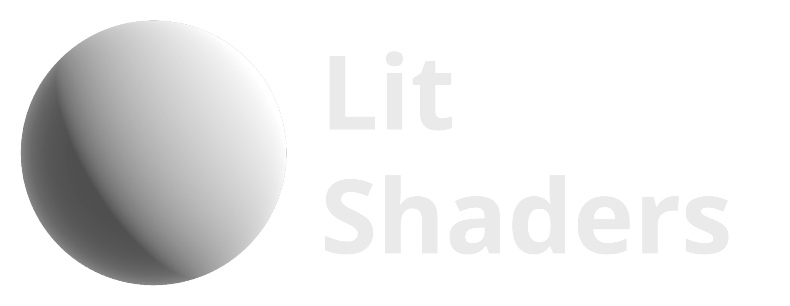

<div align="center">
  <a href="https://z3y.github.io/shaders/">
    
  </a>
  <p>Standard Shader and Surface Shaders<br>
  alternative for the Unity Built-In pipeline</p>
</div>

# Future updates moved to a new repository:
# https://github.com/z3y/Graphlit

## Installation

### - With VRChat Creator Companion

- Add listing https://z3y.github.io/vpm-package-listing/

### - With Unity Package Manager:

```
https://github.com/z3y/shaders.git
```

## [Documentation](https://z3y.github.io/shaders/)

## Features

- Bakery Features
- Shading based on Google Filament
- Specular Occlusion
- [LTCGI](https://github.com/PiMaker/ltcgi) and [Area Lit](https://booth.pm/en/items/3661829)
- Geometric Specular AA
- Box Projection on Quest
- Alpha to Coverage
- Improved Parallax
- Emission Multiply Base and GI Multiplier
- Non-Important lights per pixel
- Shader Config
- High Quality Texture Packing

## How to use

- Select a material and swap the shader to `Lit`
- Other shader variants can be found under `Lit Variants/`
- To create a new variant `Assets > Create > Shader > Lit Shader Variant`
- Read the [Documentation](https://z3y.github.io/shaders/)

## Inspector


## License

[MIT](/LICENSE.md)

Filament [Apache License 2.0](/ShaderLibrary/FilamentLicense.md),
Core RP [Unity Companion License](/ShaderLibrary/CoreRP/LICENSE.md)

#### [Patreon](https://www.patreon.com/z3y) | [Bug Reports](https://github.com/z3y/shaders/issues) | [Discord](https://discord.gg/bw46tKgRFT)
