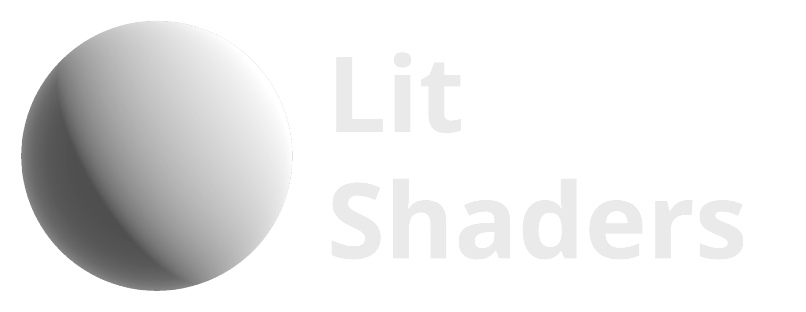

<div align="center">
  <a href="https://z3y.github.io/Shaders/">
    
  </a>
  <p>Standard Shader and Surface Shaders<br>
  alternative for Unity Built-In pipeline</p>
</div>

## Installation

### - With VRChat Creator Companion
-  Add listing https://z3y.github.io/vpm-package-listing/

### - With Unity Package Manager:

```
https://github.com/z3y/shaders.git
```

## [Documentation](https://z3y.github.io/Shaders/)

## Features
- Accurate PBR Shading
- Bakery Mono SH
- Bicubic Lightmap
- Lightmapped Specular
- Lightmapped Area Light Specular Approximation
- [LTCGI](https://github.com/PiMaker/ltcgi), [Area Lit](https://booth.pm/en/items/3661829)
- Geometric Specular AA
- Box Projection on Quest
- Alpha to Coverage
- Improved Parallax
- Emission Multiply Base and GI Multiplier
- Non-Important lights per pixel
- Shader Config
- Easy Texture Packing

## How to use

- Select a material
- Swap shader to `Lit`
- More shader variants can be found under `Lit Variants/`

## License

[MIT](/LICENSE.md)

Filament [Apache License 2.0](/ShaderLibrary/FilamentLicense.md),
Core RP [Unity Companion License](/ShaderLibrary/CoreRP/LICENSE.md)


#### [Patreon](https://www.patreon.com/z3y) | [Bug Reports](https://github.com/z3y/shaders/issues) | [Discord](https://discord.gg/bw46tKgRFT)
